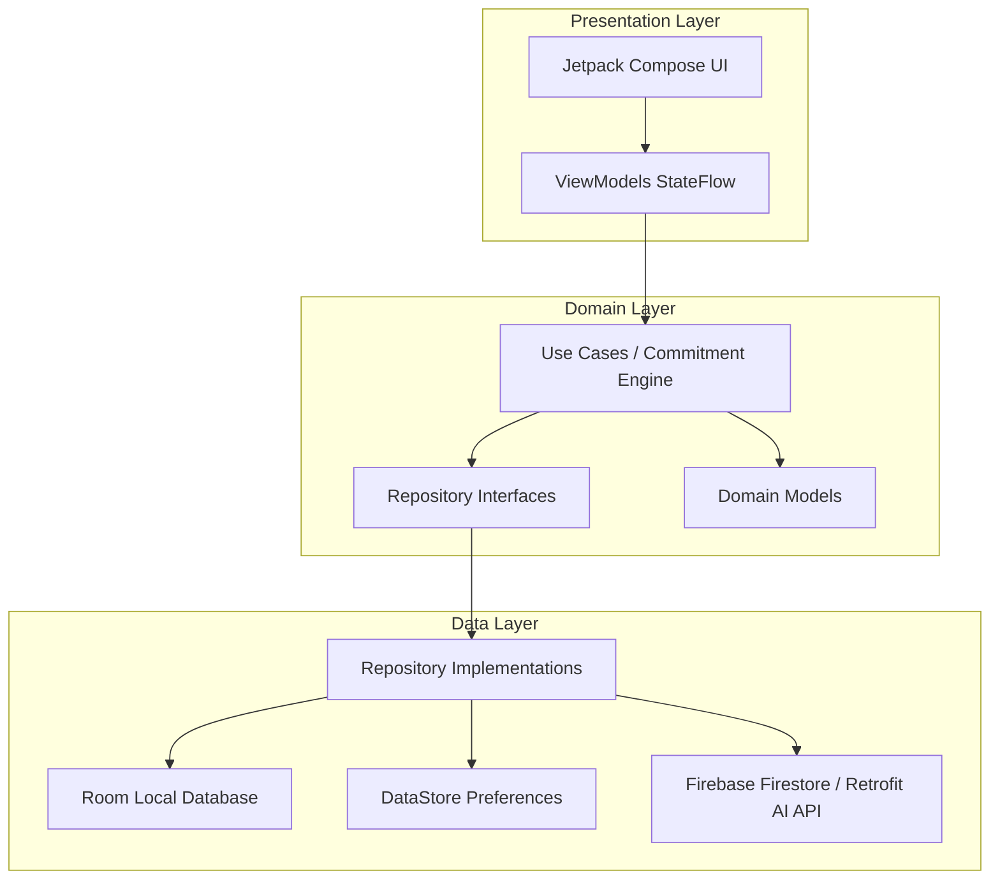

# FocusFlow — AI-Powered Productivity & Study Assistant

[](https://developer.android.com)
[](https://kotlinlang.org)
[](https://developer.android.com/jetpack/compose)
[](https://developer.android.com/topic/architecture)
[](LICENSE)

**FocusFlow** is a publishable, production-grade Android application engineered for students and professionals. It combines smart goal breakdown, AI-assisted study planning, deep Pomodoro focus sessions, habit streak tracking, real-time analytics, an interactive **AI Study Assistant**, and a unique **Commitment Lock** accountability engine.

### 🎨 Premium UI Redesign (Pastel Aesthetic)
FocusFlow features an iOS-inspired study app UI:
- **Pastel Color Palette**: Soft lavender background (`#F8F5FF`), warm lilac container accents (`#D4A5CC`), soft purple primary tokens (`#8B6CC1`), and clear visual hierarchy.
- **Component Library**: 16 custom Material 3 components including pastel `StatCard`s, gradient `AIStudyTipCard`s, timeline items, and smooth animated cards.
- **AI Assistant Chat**: Dedicated AI chat view with suggestion chips, bouncing dot typing indicators, and intuitive prompt input.
- **Study Planner**: Modern timeline schedule view with date selectors, task status toggles, and time allocation stat cards.
- **Bottom Navigation**: Floating top-rounded 4-tab bar (Home, Planner, AI Chat, Profile) with pill-shaped selection indicators.

---

## 🌟 Key Features

### 🔐 Commitment Lock & Focus Contract
- **Voluntary Accountability**: Attach a commitment to critical tasks with a strict deadline and user-selected consequences (such as policy-compliant app restriction reminders).
- **Commitment Engine**: Centralized 10-state machine (`DRAFT → ACTIVE → WARNING → COMPLETED/MISSED → RESTRICTED → RECOVERY → RESTORED`).
- **Emergency Cancellation**: Transparent, non-punitive options with score impact warning.
- **AI Recovery Plans**: Automatically generates realistic step-by-step recovery schedules for missed commitments.
- **Earn-Back System**: Restores full status through focused, timed productivity sessions.
- **Commitment Score**: Transparent accountability metric based on completion, recovery, and consistency trends.

### 🤖 AI-Powered Productivity
- **AI Task Breakdown**: Converts high-level goals into structured, prioritized subtasks with time estimates.
- **AI Study/Productivity Planner**: Generates daily study plans customized by skill level, available hours, and preferred study times.
- **AI Insights & Recommendations**: Identifies peak productivity hours and recommends optimal scheduling.
- **Secure Architecture**: AI operations route through a backend proxy model—zero hardcoded API keys in the client APK.

### ⏱️ Deep Focus & Pomodoro
- **Timer Presets**: 25/5 Pomodoro, 50/10 Deep Focus, and fully customizable durations.
- **Interactive Timer UI**: Animated Compose circular progress indicator with work/break state management.
- **Session History**: Detailed logs linking focus sessions to specific tasks and commitments.

### 📋 Task & Goal Management
- **Full Task Lifecycle**: Priority flags (Urgent, High, Medium, Low), due dates, estimated durations, categories, reminders, and nested subtasks.
- **Filter & Search**: Instant filtering by Today, Upcoming, Completed, High Priority, or search query.
- **Goals Alignment**: Link tasks to overarching long-term goals and visualize progress rings.

### 🔄 Habits & Streaks
- **Habit Tracking**: Daily, weekly, or custom-day frequency schedules.
- **Streak Engine**: Tracks current streak, longest streak, and completion rate.

### 📊 Analytics & Insights
- **Real-Data Charts**: Visualizes focus minutes, task completion rates, habit consistency, and commitment scores over Week, Month, or Year.
- **Offline-First Storage**: Local database acts as single source of truth—no empty states or fake statistics once data exists.

### 🌐 Synchronization & Offline Capability
- **Offline-First Architecture**: Powered by Room DB and DataStore for full offline access.
- **Cloud Sync**: Synchronizes seamlessly with Firebase Cloud Firestore when internet connection is restored.
- **Security Rules**: User data isolated via strict Firestore security rules.

---

## 🏗️ Architecture & Tech Stack

FocusFlow strictly follows **Clean Architecture** and **MVVM** design principles:



### Technology Stack
- **Language**: Kotlin 2.1.0 (Coroutines & Flow)
- **UI Framework**: Jetpack Compose, Material 3, Navigation Compose
- **Dependency Injection**: Dagger Hilt
- **Local Persistence**: Room Database (Offline-First), Preferences DataStore
- **Remote Services**: Firebase Authentication, Cloud Firestore, Firebase Cloud Messaging
- **Background Processing**: WorkManager
- **Networking**: Retrofit 2, OkHttp 4, Kotlinx Serialization
- **Testing**: JUnit 4, Mockk, Google Truth, Turbine

---

## 📂 Project Structure

```
com.focusflow.app/
├── data/
│   ├── local/              # Room entities, DAOs, Converters, DataStore
│   ├── remote/             # Network API clients, DTOs
│   └── repository/         # Repository implementations
├── domain/
│   ├── model/              # Domain models (Task, Goal, Habit, Commitment...)
│   ├── repository/         # Clean domain repository interfaces
│   └── usecase/            # Business logic & Commitment Engine use cases
├── presentation/
│   ├── auth/               # Login, Register, Forgot Password
│   ├── onboarding/         # Onboarding pager & preferences
│   ├── home/               # Dashboard, Progress rings, Active Commitment card
│   ├── tasks/              # Task CRUD, filters, details
│   ├── commitment/         # Commitment Lock flow, app selection, review, missed, recovery
│   ├── focus/              # Pomodoro timer, active session, completion
│   ├── habits/             # Habit tracking, creation, streaks
│   ├── planner/            # AI study planner & goal breakdown
│   ├── analytics/          # Productivity charts & Commitment Score
│   ├── settings/           # Appearance, notifications, account, privacy
│   ├── theme/              # Color, Type, Shape, Theme tokens
│   └── components/         # Reusable design system components
├── navigation/             # Screen routes & Animated NavHost
├── service/                # AppRestrictionManager, WorkManager workers, NotificationHelper
└── di/                     # Hilt DI Modules
```

---

## 🚀 Building & Setup

### Prerequisites
- JDK 17 or higher (Java 26 supported)
- Android SDK (API 35, Min SDK 26)
- Android Studio Ladybug / Koala or CLI

### Step 1: Clone Repository
```bash
git clone https://github.com/MohammadMohid03/focusflow.git
cd focusflow
```

### Step 2: Environment Configuration
Create `local.properties` in the root directory:
```properties
sdk.dir=C:/Users/moham/AppData/Local/Android/Sdk
```

### Step 3: Firebase Configuration
Place your `google-services.json` inside `app/` directory and uncomment the plugin in `app/build.gradle.kts`:
```kotlin
alias(libs.plugins.google.services)
```

### Step 4: Build Debug APK
```bash
./gradlew assembleDebug
```

### Step 5: Run Unit Tests
```bash
./gradlew test
```

### Step 6: Generate Production Release Bundle (AAB)
```bash
./gradlew bundleRelease
```

---

## 🔒 Security & Privacy

- **No Hardcoded Secrets**: All AI interactions communicate through a secure server proxy.
- **Data Minimization**: App restriction preferences remain local to the device and are never uploaded to analytics or AI backends.
- **Firestore Isolation**: Security rules restrict all reads/writes strictly to authenticated owner user IDs.

---

## 📄 License

FocusFlow is released under the [MIT License](LICENSE).
